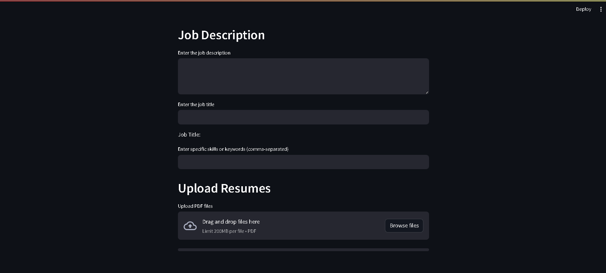
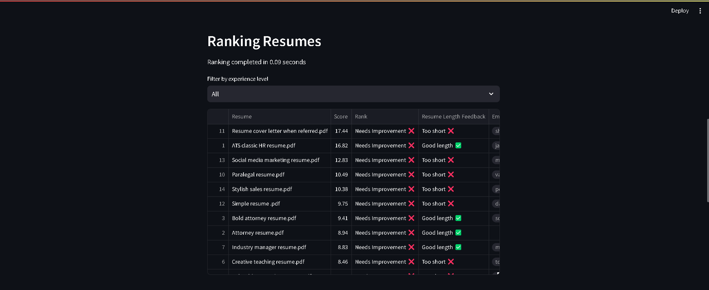
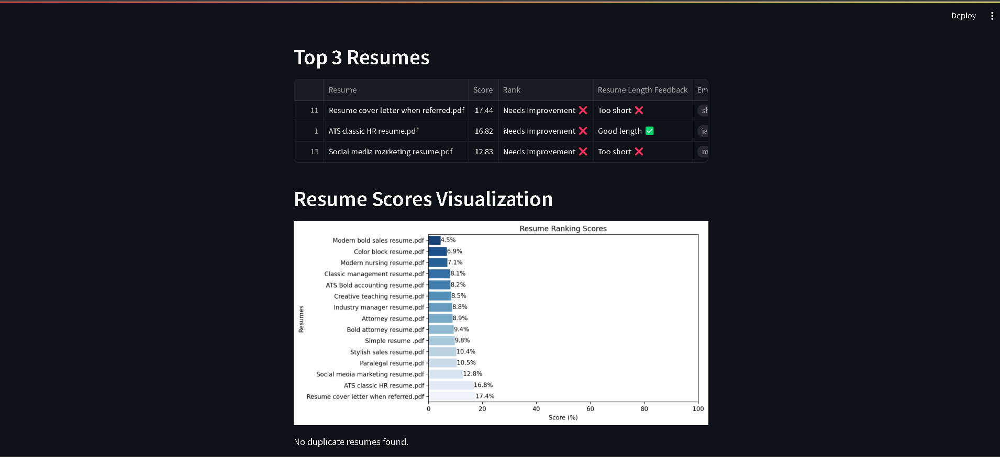
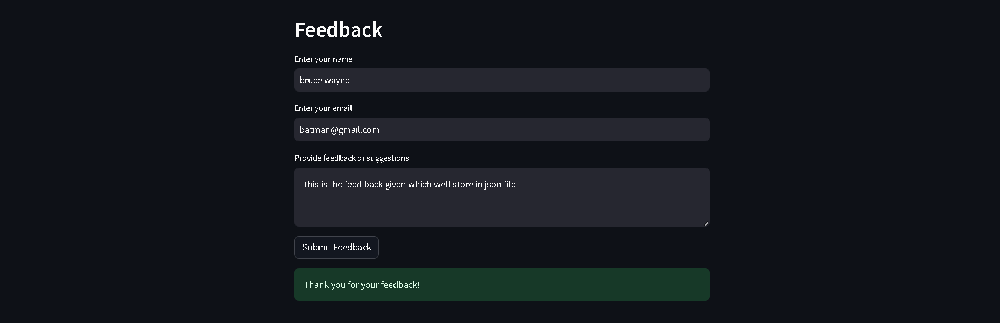

# AI-Powered Resume Screening & Ranking System  

An AI-driven web application that automates the process of **resume screening and ranking** based on job descriptions. The system extracts **text from PDFs**, applies **Natural Language Processing (NLP) techniques**, and ranks resumes using **TF-IDF vectorization and cosine similarity**.  

## 🚀 Features  
- **Automated Resume Ranking** – Uses **TF-IDF & Cosine Similarity** for job-resume matching.  
- **Experience-Based Weighting** – Adjusts ranking based on **entry-level, mid-level, and senior experience**.  
- **Duplicate Resume Detection** – Prevents multiple submissions of the same resume.  
- **Resume Length Analysis** – Provides feedback on whether a resume is **too short or too long**.  
- **Contact Information Extraction** – Automatically extracts **emails and phone numbers** from resumes.  
- **Keyword Matching** – Allows recruiters to enter **specific skills** to refine rankings.  
- **Data Visualization** – Displays **resume score distributions** using Seaborn and Matplotlib.  
- **User Feedback Collection** – Allows users to submit feedback, stored in a **JSON file**.  

## 🛠️ Technologies Used  
- **Python** – Main programming language  
- **Streamlit** – Web interface  
- **Scikit-learn** – Machine learning (TF-IDF, Cosine Similarity)  
- **PyPDF2** – Extracting text from PDF resumes  
- **Pandas & NumPy** – Data handling  
- **Seaborn & Matplotlib** – Data visualization  
- **JSON** – Storing user feedback  

## 📌 Usage Instructions  
1. **Enter the job description** in the provided text box.  
2. **Upload multiple resumes** (PDF format) – Maximum **10 resumes per batch**.  
3. The system **analyzes resumes**, extracts relevant details, and **ranks them** based on job description similarity.  
4. **View results** – including **scores, rank categories, experience levels, and visualizations**.  
5. **Download the ranked resume list** as a **CSV file**.  
6. **Submit feedback** about the system, which is stored in `feedback.json`.  

## 🔍 Sample Job Description & Keywords  

### **Job Title:** Data Scientist  

#### **Job Description:**  
We are looking for a **Data Scientist** with experience in **machine learning, data analysis, and predictive modeling**. The ideal candidate should have strong programming skills in **Python or R**, experience working with large datasets, and knowledge of deep learning frameworks such as **TensorFlow or PyTorch**. The role involves developing AI-driven models, optimizing data pipelines, and collaborating with cross-functional teams to drive data-driven decision-making.  

#### **Keywords:**  
- Machine Learning  
- Data Analysis  
- Python  
- R  
- TensorFlow  
- PyTorch  
- Big Data  
- Statistical Analysis  
- NLP  
- Feature Engineering
- 
## 📸 Implementation Snapshots  

### 1️⃣ System Interface - Resume Upload  
  

### 2️⃣ Resume Ranking Output  
  

### 3️⃣ Score Visualization  
  

### 4️⃣ Feedback Submission  
  

## 📜 License  
This project is licensed under the **MIT License** – you are free to use and modify it.  

